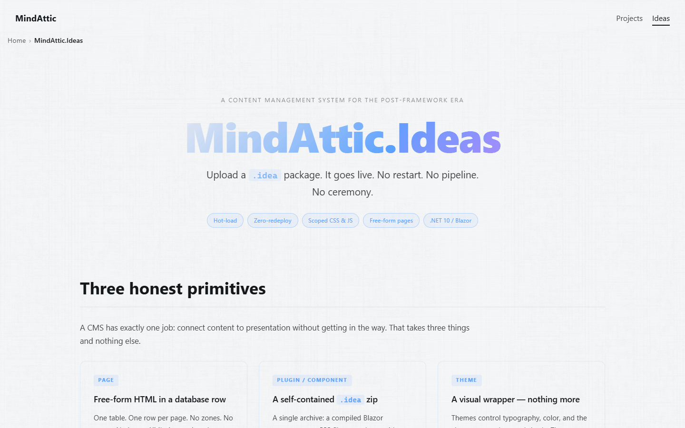
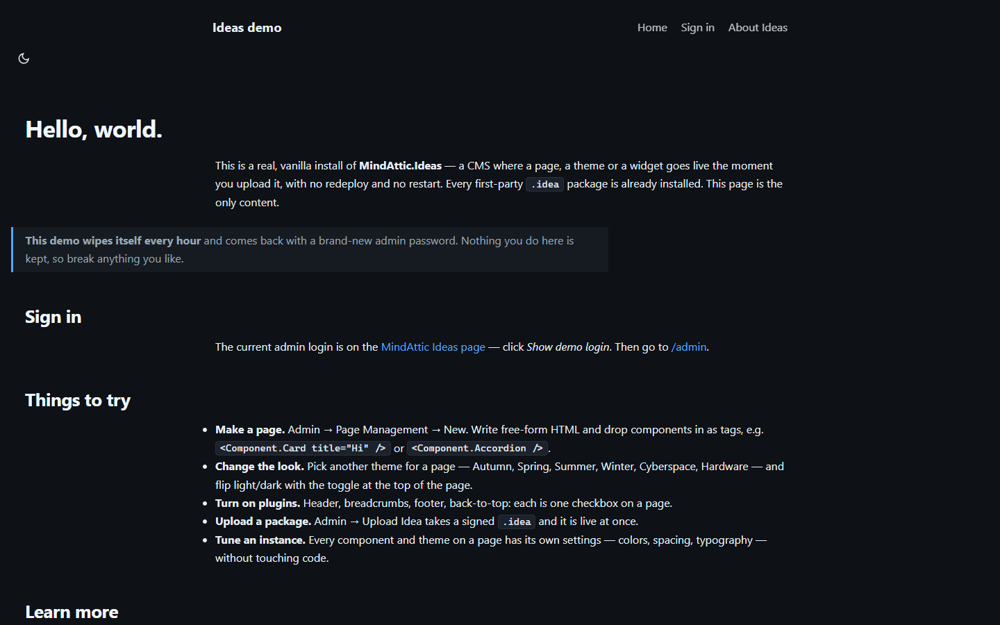
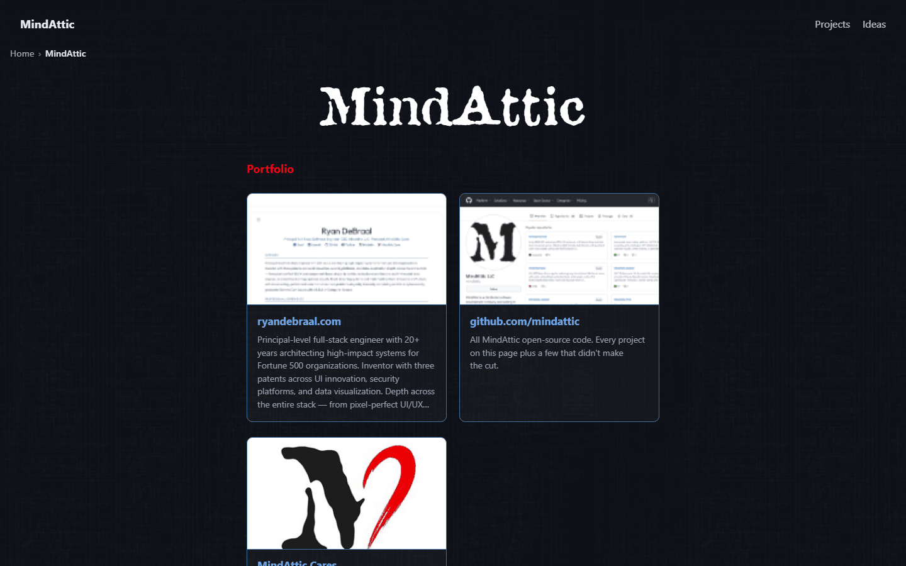

# MindAttic.Ideas

A single-deployment Blazor CMS for .NET 10: upload a .idea package and a page, theme, plugin or component goes live at once, with no redeploy and no app restart.

[](src) [](src/MindAttic.Ideas.Blazor/MindAttic.Ideas.Blazor.csproj) [](src/MindAttic.Ideas.Blazor) [](docs/DEPLOYMENT.md) [](https://mindattic-ideas-demo.azurewebsites.net)



Try it: the public demo at [mindattic-ideas-demo.azurewebsites.net](https://mindattic-ideas-demo.azurewebsites.net) is a vanilla install with every first-party package, wiped and re-provisioned every hour. The current admin login is shown (behind a human check) on the [Ideas page](https://mindattic.azurewebsites.net/ideas) of the company site, which itself runs on Ideas.

## Why

- Host many pages, and many domains, from one App Service, one app pool and one database, instead of one web app per landing page.
- Ship a new page, theme or widget by uploading a zip. It is live the moment the upload finishes: no pipeline, no restart.
- Never break a live page by shipping. Versions are whole numbers that coexist, so `V2` lands beside `V1` and pinned pages keep working.
- Never show a crash for a missing piece. A missing or disabled reference renders a clickable placeholder and raises an Admin Inbox alert.
- Write pages as free-form HTML. There are no zones, panes, slots or grids to fight, the opposite of DotNetNuke's fixed-layout model.
- Move a hand-built site between environments with one export/import file, packages included.

## Features

**Authoring**

- Data pages: free-form `BodyHtml`, `PageCss` and `PageJs` stored in the database, edited in the admin UI. This is the primary, zero-deploy path.
- Code pages: a compiled `.razor` `PageBase` subclass shipped as a `.idea`, for real Blazor C# interactivity. A page can switch between the two as a row edit.
- Composition by tag: `<Component.Card />`, `<Plugin.Tooltip />`, `<Theme.Cyberspace />`, with attributes flowing through as typed settings.
- Every Theme, Plugin and Component instance is configurable from a schema-generated admin editor, with Copy and Paste Configuration between instances.
- Every theme ships a light and a dark palette; the ThemeToggle plugin switches them without a flash of the wrong mode.



**Packaging and versioning**

- The `.idea` package is a plain zip with one required `idea.json` manifest. Data packages install with zero build and zero recycle.
- Compiled packages load into a per-package collectible `AssemblyLoadContext`, so uploads need no app-pool restart.
- Whole-number versions (`V1`, `V2`), version-specific disable, and reference-guarded delete.
- Page history in SQL Server temporal tables: every page version records which citizen versions it carried.
- The `ma-idea` CLI packs, inspects, lists, verifies, signs and wraps packages as NuGet packages, all offline.
- Every `.idea` carries its own RSA-PSS/SHA-256 content signature, verified at the single install choke point.

**Operations**

- One deployment, many domains: each Site row has host bindings, so two domains can both own a `/frontpage`.
- Portable `.idealist` files move authored content (pages, settings, media, packages list) between environments.
- Media is stored on local disk or Azure Blob, chosen by config, always addressed as `/_media/{uid}`.
- Sign-in through MindAttic.Authentication; credentials through MindAttic.Vault; passwordless managed identity in Azure.



## Quick start

Prerequisites: the .NET 10 SDK, SQL Server LocalDB (the host falls back to `(localdb)\MSSQLLocalDB` database `MindAtticIdeas` when no `ConnectionStrings:Ideas` is configured), and the machine-local MindAttic.Vault files described in [`docs/DEV_LOGIN.md`](docs/DEV_LOGIN.md).

```powershell
git clone https://github.com/mindattic/MindAttic.Ideas.git
cd MindAttic.Ideas

dotnet build MindAttic.Ideas.slnx -c Debug
dotnet test src/MindAttic.Ideas.Tests/MindAttic.Ideas.Tests.csproj
dotnet run --project src/MindAttic.Ideas.Blazor
```

The host listens on `https://localhost:7207` and `http://localhost:5229` (`Properties/launchSettings.json`). Sign in at `/login` as `admin` with the Vault bootstrap token; you are forced to change the password on first sign-in ([`docs/DEV_LOGIN.md`](docs/DEV_LOGIN.md)). Then open `/admin` to create pages and upload `.idea` files.

`launch.bat` runs `tools/deploy.ps1 -Launch`, which rebuilds, publishes to a local folder and launches that fresh copy.

## How it works

A Page is free-form. A Theme wraps it. Plugins activate site-wide behaviour. Components drop into exact positions. Inline CSS and JS are yours.

```text
                upload/CLI a .idea (plain zip)
                          |
                          v
   +--------------------------------------------------------------+
   |  MindAttic.Ideas.Blazor   (Blazor Web App, global InteractiveServer)
   |   PageHost  /{*slug}  -->  resolve (SiteId, Slug) -> Theme -> render
   |   CmsHead (fixed CSS cascade)   /_ideas/{Kind}/{key}/{ver}/... assets
   |   /admin (Admin policy)         Vault + Legion + Authentication
   +-----------+----------------------------------+---------------+
               | uses                             | uses
   +-----------v------------+        +------------v----------------------+
   | MindAttic.Ideas.Core   |        | MindAttic.Ideas.Packaging         |
   |  CmsDbContext (EF, SQL,|        |  manifest kernel, reader,         |
   |   temporal Pages)      |        |  validator, packer, SHA-256       |
   |  ContentCatalog        |        |  (pure, IO-free)                  |
   |  IncludeExpander       |        +------------+----------------------+
   |  RawContentGate        |                     |
   |  collectible ALC load  |        +------------v----------------------+
   +-----------+------------+        | MindAttic.Ideas.Sdk (ma-idea CLI) |
               | references          +-----------------------------------+
   +-----------v-----------------------------------------------------+
   | MindAttic.Ideas.Abstractions   (frozen v1 SDK, MAJOR pinned at 1) |
   |  IdeaBase + PageBase / PluginBase / ThemeBase / ComponentBase    |
   |  refs ONLY Microsoft.AspNetCore.Components + System.Text.Json    |
   +------------------------------------------------------------------+
```

Pages resolve by `(SiteId, Slug)` through one catch-all `PageHost`; there is no per-page routing, so a runtime-loaded type renders with zero router changes. The unit you install is a `.idea` zip; what it contains is one of four content kinds, all deriving from `IdeaBase` (`src/MindAttic.Ideas.Abstractions/Bases.cs`):

| Kind | Ordinal | What it is | Base type | Example reference |
|---|---|---|---|---|
| Page | `0` | Free-form or compiled page content, resolved by `(SiteId, Slug)` | `PageBase` | `MindAttic.Ideas.Page.HelloWorld.V1` |
| Plugin | `1` | A site-wide capability activator: loads CSS/JS across the whole page | `PluginBase` | `MindAttic.Ideas.Plugin.Tooltip.V1` |
| Theme | `2` | Layout chrome with one `Body` hole and a CSS bundle | `ThemeBase` | `MindAttic.Ideas.Theme.Cyberspace.V1` |
| (removed) | `3` | `Control` was deleted before 1.0; the ordinal is never reused | none | none |
| Component | `4` | An inline UI unit rendered at its exact tag position; can nest other Components | `ComponentBase` | `MindAttic.Ideas.Component.Textbox.V1` |

"Idea" names the shared base, the `.idea` package format and the `/_ideas/...` asset route; it is never a content kind. New kinds may be appended to the enum (new ordinals only, never renumbered).

A Plugin is a capability activator: `<Plugin.Tooltip />` loads the tooltip engine so that afterwards any element with `data-tooltip` or `data-tt` shows a tooltip. By default `PluginBase` renders only the `link` and `script` tags for its `StylesheetUrls` and `ScriptUrls`. A Component renders real markup at its tag position (for example `Component.Textbox` renders an input). Plugins can also be switched on per page in Page Properties, or site-wide through the site's default plugin list.

### Two ways to author a Page, one render path

- Data page (zero deploy): free-form `BodyHtml` / `PageCss` / `PageJs` in the database. Citizen tags in the body are expanded into live content at render time by `IncludeExpander`.
- Code page (compiled): a `PageBase` subclass, a `.razor` component shipped as a `.idea`, for genuine Blazor C# interactivity. It deploys once per type, never per page instance.

Both are `Page` rows resolved by `(SiteId, Slug)` and rendered through the same `PageHost` primitive. A page can graduate Data to Code as a row edit, never a schema change.

## Tag grammar

In a Data page body the composition grammar is the PascalCase tag form ([MAI-§4.4](docs/BIBLE.md#MAI-§4.4)):

```html
<Theme.Cyberspace />
<Plugin.Tooltip />
<Component.Textbox label="Email" />
<Component.TabBoard alwaysShowTabPage="true" />
<Component.TabBoard data-version="2" />
```

- The first segment is the kind (`Theme`, `Plugin`, `Component`); the second is the content key.
- Omit `data-version` to float to the latest enabled version; `data-version="2"` pins version 2.
- Attributes that match a declared setting are coerced to its type; others pass through.
- A missing or disabled reference degrades to a clickable placeholder that opens the admin uploader prefilled with the missing reference, never a crash.
- A page picks its theme in Page Properties (an inline `<Theme.X />` override is planned, MAI-US-H3).

`{{ … }}` brace tokens are not part of the grammar; `SeedService` converts any found in stored content into tags at startup.

Identity is inferred by convention: Kind from the base type, Key from the namespace tail, Version from the `V{n}` class name. An optional `[Idea(key:, version:, scope:)]` attribute overrides the convention when a name can't follow it.

## Composing citizens with CmsInclude

A compiled Page, Theme or Component references another citizen by string id, with zero compile-time reference to that citizen's package. This is `CmsInclude`, defined once in `src/MindAttic.Ideas.Abstractions/CmsInclude.cs`:

```razor
<CmsInclude Ref="MindAttic.Ideas.Plugin.Tooltip.V1" />
<CmsInclude Ref="MindAttic.Ideas.Component.Textbox.V1" placeholder="Name" />
<CmsInclude Ref="MindAttic.Ideas.Component.Accordion" />
```

`CmsInclude` takes the cascaded `IRenderContext`, resolves the `IIncludeRenderer` host feature from it and delegates rendering. With no host feature present (for example at Blazor design time) it renders nothing rather than throwing. Unmatched attributes flow straight through to the resolved citizen. A `Ref` with no version floats to the latest.

Declare what a compiled citizen depends on with the repeatable `[Uses(ContentKind, key, version)]` attribute (`version: 0` floats to latest):

```csharp
[Uses(ContentKind.Plugin, "tooltip", 1)]
[Uses(ContentKind.Component, "textbox", 1)]
public sealed class V1 : PageBase { }
```

`[Uses]` feeds the manifest's `uses[]` array, which drives four things: head-asset hoisting for the referenced citizen's CSS/JS, an install-time missing-dependency warning, the delete reference guard, and the pre-upload compose-graph check (`ma-idea verify`).

Themes are not placed with `CmsInclude`: a page selects its theme through the `ThemeKey` / `ThemeVersion` Page Properties (or a `<Theme.X />` tag), and the host wraps the body in it.

## Versioning and lifecycle

Versions are whole numbers only (`V1`, `V2`, `V3`), never SemVer, for every kind. This is the heart of "never change, only enhance":

- You never mutate `Cyberspace.V1`. You ship `Cyberspace.V2` alongside it; versions coexist.
- A reference may pin a version when a page cares, or float to the latest when it doesn't.
- A page must never be invalid. At render, a missing or disabled reference degrades to a visible placeholder and fires an Admin Inbox alert.
- Disabled means a version exists but can't be used until it is re-enabled.
- Delete is version-specific and reference-guarded: you can't delete `Tooltip.V11` while any page pins it. A floating reference is fine as long as some enabled version remains.
- SQL Server temporal (system-versioned) tables keep wiki-like history: every Page version records which Plugin, Component and Theme versions it carried, so you can inspect and roll back to any prior state.

## Abstractions SDK

Everything an author compiles against lives in one frozen project, `src/MindAttic.Ideas.Abstractions`. It references only `Microsoft.AspNetCore.Components` and `System.Text.Json`, and its public surface is append-only forever (MAJOR pinned at `1`, the `Sdk.Version` constant): members may be added, never removed, renamed or made abstract.

| File | What it defines |
|---|---|
| `Bases.cs` | `IdeaBase` (shared root: cascaded `IRenderContext`, `SafeUrl` / `IsUnsafeUrl` XSS guards) and the four kind bases. `PageBase` (and generic `PageBase<TSettings>`), `ThemeBase` (`Body` hole, `GlobalCssUrls` / `ThemeCssUrls` / `ScriptUrls`, `BodyPreludeHtml`, `PagePadding` / `PageMargin`), `PluginBase` and `ComponentBase` (asset URLs; `ComponentBase` aliases Blazor's own as `BlazorComponentBase` internally). |
| `Enums.cs` | `ContentKind` (Page 0, Plugin 1, Theme 2, Component 4), `PageKind` (Data, Code), `CmsRenderMode` (Static, InteractiveServer; WebAssembly is excluded by a hard .NET ALC boundary), `ContentMode`, `ContentOrigin`, `RenderStrategy`, `PlacementScope`, `ContentTrust` (Untrusted, Author). |
| `Attributes.cs` | `[Idea]` (override the naming convention), `[Uses]` (declare a string-id dependency), `[Setting]` (admin label, group, order, help, `Copyable`), `[IdeaSdkVersion]` (stamped by the packer), `Sdk.Version`. |
| `Contexts.cs` | `IRenderContext` (instance id, mode, page and site contexts, scoped services, settings, and the additive `TryGetFeature<T>()` escape hatch), `IPageContext`, `ISiteContext`, `IInlineMarkup`. Host features: `IIncludeRenderer`, `IComponentMetadataStore`, `IPageTree`. |
| `Discovery.cs` | `ContentDescriptor`, `ICmsContentSource`, `ITypeResolver`, `IContentCatalog` (`Find` / `FindLatest` / `ResolveTag`), `ContentResolution` (Resolved, Missing, Disabled), `IRenderAlertSink`, `IRawContentGate`, and `SharedContracts.DeferToDefaultPrefixes` (the ALC unification allow-list). |
| `CmsInclude.cs` | The `CmsInclude` component itself. |

Extension points:

| To build a | Derive from | Override |
|---|---|---|
| Page | `PageBase` or `PageBase<TSettings>` | Razor markup; `[Uses]` for string-id dependencies |
| Theme | `ThemeBase` | `Body` hole, `GlobalCssUrls` / `ThemeCssUrls` / `ScriptUrls`, `BodyPreludeHtml` |
| Plugin | `PluginBase` | `StylesheetUrls` / `ScriptUrls`; override `BuildRenderTree` for markup |
| Component | `ComponentBase` | `StylesheetUrls` / `ScriptUrls`, `BuildRenderTree`; typed `[Parameter]` settings |

A citizen's instance settings are its public, writable, simple-typed `[Parameter]`s (bool, string, integer, floating, enum). For a Component they are its tag attributes; for a Theme, page-level Plugin or Code page they live in the page's versioned instance-settings slots. There is deliberately no "settings for every instance of X" layer; configuration is shared by Copy and Paste Configuration in the admin ([MAI-§4.5](docs/BIBLE.md#MAI-§4.5)).

## The idea package format

A `.idea` is a plain zip. Its only required member is `idea.json`; the manifest kernel is defined in `src/MindAttic.Ideas.Packaging/IdeaManifest.cs` and its six required fields never change:

```json
{
  "manifestVersion": 1,
  "category": "Plugin",
  "kind": "data",
  "key": "tooltip",
  "version": 1,
  "displayName": "Tooltip"
}
```

- `category` is what it is (Page, Plugin, Component, Theme); `kind` is how it renders (data or code).
- `key` is the stable identity, never the CLR type name; `version` is the whole-number content version.
- Optional, append-only fields: `sdk`, `entryType`, `renderMode`, `css[]`, `scripts[]`, `assets`, `uses[]`, `uiux[]`, `settings[]`.

```text
tooltip.idea (a zip)
 +- idea.json                 required
 +- wwwroot/                  css/js/assets, served at /_ideas/{category}/{key}/{version}/...
 +- bin/                      kind=code only: the compiled assembly and non-host dependencies
 +- data/                     optional idempotent seed
 +- icon.png  README  LICENSE never parsed
 +- idea.sig.json             content signature (RSA-PSS/SHA-256)
```

Unknown fields and folders are ignored, for forward compatibility. Host-provided assemblies (`MindAttic.Ideas.Abstractions`, `Microsoft.*`, `System.*`) are forbidden in `bin/`, and `ManifestValidator` audits for this. `MindAttic.Ideas.Packaging` (pure, IO-free, NUnit-tested) is the whole wire contract: manifest kernel, reflection-only `Packer`, zip-slip-guarded `IdeaArchiveReader`, `ManifestValidator`, `Sha256Hasher`, `PackageVersionResolver` and `PackageSigner`. `Packer.Pack` also runs `CitizenValidator`: a citizen with colliding settings, reserved setting names, `eval(`-style JavaScript or `expression(`-style CSS produces no package.

## Project layout

```text
MindAttic.Ideas.slnx                  CMS engine solution
src/
  MindAttic.Ideas.Abstractions        the frozen SDK
  MindAttic.Ideas.Core                EF entities, CmsDbContext (SQL Server, temporal Pages),
                                        discovery, catalog, raw-content gate, include expander,
                                        ALC loader, idealist import/export, seed
  MindAttic.Ideas.Packaging           pure .idea wire contract
  MindAttic.Ideas.Rendering           rendering support (CmsHead, PageHost)
  MindAttic.Ideas.Sdk                 the ma-idea CLI
  MindAttic.Ideas.Blazor              the Blazor Web App host and its CLI verbs
  MindAttic.Ideas.Tests               NUnit suite
library/                              first-party Themes, Plugins, Components
  MindAttic.Ideas.Library.slnx        independent solution; references only Abstractions
  Themes/  Plugins/  Components/      one small csproj per citizen
  dist/                               packed *.idea output
  tools/                              pack-all.ps1, publish-nuget.ps1, codex.ps1
samples/MindAttic.Ideas.Page.HelloWorld   the reference modular Page
templates/maidea-page                 dotnet new template that scaffolds a Page
seed/                                 demo and mindattic-site idealists
infra/                                Bicep and provisioning scripts for Azure
e2e/                                  Cypress end-to-end suite
docs/                                 Codex canon: BIBLE, AMENDMENTS, USER_STORIES, guides
tools/                                build-readme, codex, deploy, install-library, shoot (screenshots)
```

## Authoring a Page from the template

The fastest way to build a new Page citizen is `dotnet new` from `templates/maidea-page`, which scaffolds what [samples/MindAttic.Ideas.Page.HelloWorld](samples/MindAttic.Ideas.Page.HelloWorld) shows working end to end:

```powershell
# Install the template once, from the repo root
dotnet new install ./templates/maidea-page

# Scaffold a new Page (run from samples/ so the relative Abstractions path resolves)
cd samples
dotnet new maidea-page -n MyPage --slug my-page --theme cyberspace
```

| Template parameter | Default | What it does |
|---|---|---|
| `-n` / `--name` | required | Short name; becomes `MindAttic.Ideas.Page.<Name>` |
| `--slug` | `hello-world` | Route the page is served at after install |
| `--theme` | `cyberspace` | Theme key the page wears (referenced by string, never bundled) |

The generated project is a Razor Class Library that compiles against only `MindAttic.Ideas.Abstractions`:

```xml
<Project Sdk="Microsoft.NET.Sdk.Razor">
  <PropertyGroup>
    <TargetFramework>net10.0</TargetFramework>
    <Version>1.0.0</Version>
    <IsPackable>false</IsPackable>
  </PropertyGroup>
  <ItemGroup>
    <ProjectReference Include="..\..\src\MindAttic.Ideas.Abstractions\MindAttic.Ideas.Abstractions.csproj"
                      Private="false" ExcludeAssets="runtime" />
  </ItemGroup>
</Project>
```

`Private="false"` and `ExcludeAssets="runtime"` keep Abstractions out of the packed `bin/`. The sample page itself, abridged:

```razor
@namespace MindAttic.Ideas.Page.HelloWorld
@inherits PageBase
@attribute [Uses(ContentKind.Plugin, "tooltip", 1)]
@attribute [Uses(ContentKind.Component, "textbox", 1)]

<section class="hello">
    <h1>Hello, world.</h1>
    <CmsInclude Ref="MindAttic.Ideas.Plugin.Tooltip.V1" />
    <p><button type="button" data-tooltip="Resolved at runtime by string id.">Hover me</button></p>
    <p><CmsInclude Ref="MindAttic.Ideas.Component.Textbox.V1" placeholder="Type here" /></p>
</section>
```

Identity comes from convention: namespace tail `HelloWorld` gives key `helloworld`, class `V1` gives version 1. `data/page.json` seeds the initial Page row (slug, title, theme key and version, published). Build, pack and inspect it (full detail in [docs/AUTHORING.md](docs/AUTHORING.md)):

```powershell
dotnet build -c Release samples/MyPage

dotnet run --project src/MindAttic.Ideas.Sdk -- pack `
  --assembly samples/MyPage/bin/Release/net10.0/MindAttic.Ideas.Page.MyPage.dll `
  --out ./dist `
  --refs src/MindAttic.Ideas.Abstractions/bin/Debug/net10.0

dotnet run --project src/MindAttic.Ideas.Sdk -- inspect ./dist/MindAttic.Ideas.Page.MyPage.V1.idea
```

Then drop the `.idea` on the admin upload page. The host validates it (the same gate as an install), registers the type, extracts its `wwwroot/`, and it is live at its slug.

## A Plugin from the first-party library

A Plugin is smaller still when it is mostly asset activation. This is the core of the shipped `library/Plugins/Tooltip/V1.cs`, abridged (the real file adds typed instance settings for colours, sizing and behaviour):

```csharp
using MindAttic.Ideas.Abstractions;

namespace MindAttic.Ideas.Plugin.Tooltip;

public sealed class V1 : PluginBase
{
    private const string Mount = "/_ideas/Plugin/tooltip/1";

    public override IReadOnlyList<string> StylesheetUrls { get; } = new[] { Mount + "/tooltip.css" };
    public override IReadOnlyList<string> ScriptUrls { get; } = new[] { Mount + "/tooltip.js" };
}
```

Its assets live in a plain `assets/` folder next to the code (not `wwwroot/`, to avoid the Razor static-web-asset collision):

```text
library/Plugins/Tooltip/
 +- MindAttic.Ideas.Plugin.Tooltip.csproj   settings inherited from Directory.Build.props
 +- AssemblyInfo.cs
 +- V1.cs
 +- assets/
     +- tooltip.css
     +- tooltip.js
```

That one `assets/` bundle serves three consumers with no duplication: a raw `.html` page links the CSS and JS directly, a standalone Blazor app references the RCL or the same folder, and the CMS installs the packed `.idea` whose `wwwroot/` is that folder, served at `/_ideas/Plugin/tooltip/1/`.

## First-party library

`library/` (`library/MindAttic.Ideas.Library.slnx`) is the home of every official Theme, Plugin and Component. It is build-independent of the CMS: it references only Abstractions, and the CMS never compile-references it, it only installs the packed output. A vanilla deployment installs everything in `library/` at boot.

| Folder | Citizens with a project on disk |
|---|---|
| `Themes/` (7) | Autumn, Cyberspace, Hardware, Ideas, Spring, Summer, Winter |
| `Plugins/` (15) | AtticFont, BackHomeM, BackToTop, Breadcrumbs, Cyberspace, Footer, Header, NavMenu, OutfitFont, PinFooter, PoweredBy, SacredGeometry, SocialLinks, ThemeToggle, Tooltip |
| `Components/` (31) | Accordion, AppLaunch, Callout, Card, Carousel, ChiMesh, Claudia, CodeBlock, ContactForm, FromHtml, FromMd, Frontpage, Gallery, HardwareHero, HelloWorld, Hero, IdeasBrochure, IdeasFrontpage, LegionPersonas, MediaImage, MediaLink, MindAtticFrontpage, ModalPopup, ProjectBrochure, ProjectGrid, TabBoard, TableOfContents, Tabs, Textbox, VideoEmbed, WebSnapshot |

`library/dist/` holds the 53 packed `.idea` files. Every theme carries a light and a dark palette ([MAI-§4.13](docs/BIBLE.md#MAI-§4.13)).

```powershell
# Build one citizen
dotnet build -c Release library/Plugins/Tooltip

# Build everything in the library
dotnet build -c Release library/MindAttic.Ideas.Library.slnx

# Pack and verify (from the repo root)
dotnet run --project src/MindAttic.Ideas.Sdk -- pack `
  --assembly library/Plugins/Tooltip/bin/Release/net10.0/MindAttic.Ideas.Plugin.Tooltip.dll `
  --out library/dist --wwwroot library/Plugins/Tooltip/assets `
  --refs src/MindAttic.Ideas.Abstractions/bin/Debug/net10.0

dotnet run --project src/MindAttic.Ideas.Sdk -- verify library/dist
```

`library/tools/pack-all.ps1` packs the whole library (`-Sign` signs from the Vault PackageSigning bucket). The library has its own Codex canon under `library/docs/`, including `library/docs/data/components.json`, a machine-readable catalog of every shipped `.idea`; see [library/README.md](library/README.md) and [library/CLAUDE.md](library/CLAUDE.md).

## CSS cascade

The cascade order is fixed and enforced in exactly one place, `CmsHead` (`src/MindAttic.Ideas.Rendering/CmsHead.razor`):

```text
GLOBAL (0)  ->  THEME (100)  ->  PAGE (150)  ->  COMPONENT (200)  ->  inline style="" (300+)
host setting    e.g. Cyberspace   Page.PageCss    a citizen's own CSS   by DOM nature
```

- `CmsHead` emits `@layer global, theme, page, component;` before any CSS and wraps each tier in its named layer, so the order wins by cascade-layer precedence rather than selector specificity. No tier needs `!important` to beat a lower one ([MAI-§4.7](docs/BIBLE.md#MAI-§4.7)).
- Component CSS beats Page CSS by design: a Component guarantees its own presentation whatever page it sits in ([MAI-§4.7](docs/BIBLE.md#MAI-§4.7)).
- On save, `CssConflictMerger` collapses exact same-selector conflicts in an Untrusted page's own `PageCss`; author-trusted CSS is stored as written. `CssShorthandLinter` flags shorthand/longhand mixes as an advisory.

A per-page tweak is either inline CSS in the Page definition or an uploaded `.idea`.

## Trust and security

Sign-in is delegated to [MindAttic.Authentication](https://github.com/mindattic/MindAttic.Authentication) (Argon2id with pepper, Vault-backed, hardened sessions). `src/MindAttic.Ideas.Blazor/Program.cs` wires it with `AddMindAtticAuthentication<CmsDbContext>(...)` and `AppName = "Ideas"`, a hard per-app trust boundary with no cross-app SSO. The package (6.0.0) sends auth email over SMTP once `MindAttic:Vault:Notifications:email` is complete (dev: the Vault `Notifications` bucket, already loaded; prod: `MindAttic__Vault__Notifications__email__*` app settings, which `infra/main.bicep` does not set); until then it logs a startup warning and sends nothing. That covers password-reset links and security alerts (password changed or reset, two-step verification turned on, recovery code used, repeated failed sign-ins, new-device sign-in, email changed, account deactivated). Self-service reset: `/login` links to `/forgot-password` (the library's `MaForgotPassword`), and the emailed link opens `/account/reset` (`MaResetPassword`). Links are built from `MindAttic:Auth:Reset:PublicBaseUrl`: `https://localhost:7207` in `appsettings.Development.json`; `infra/main.bicep` sets `https://mindattic.azurewebsites.net` for the company site and `https://mindattic-ideas-demo.azurewebsites.net` for the demo, applied on the next `infra/provision.ps1` run. What stays Ideas-owned is the raw-content trust gate:

- On save, a page body is stamped `ContentTrust.Author` only if the writer holds the `Cms.AuthorRawMarkup` claim (Admin role); otherwise `Untrusted`.
- Every page body, at every trust level, goes through HtmlSanitizer before rendering ([MAI-§4.6](docs/BIBLE.md#MAI-§4.6)). No script, event handler, `javascript:` / `vbscript:` / `data:` URL, frame, form, embed or style element survives in page markup.
- Author trust only keeps more: citizen tags and their settings, `id`, form-less buttons, `target` (always with `rel="noopener noreferrer"`) and sanitized inline `style`. Untrusted bodies drop citizen tags.
- Deliberate author JavaScript lives only in the separate, Author-only Page JS field, never in markup.
- Demoting an author is a deliberate policy action (an `AuthorTrustVersion` epoch bump), never a silent re-render of live pages.

Validation runs in three places with one rule set: on page save (`PageMarkupValidator`, shown in the admin), at pack time (`CitizenValidator`), and in CI (`ShippedContentValidationTests` checks every shipped package and every page of the seed idealist).

## One deployment, many domains

A single Ideas instance can serve several domains ([MAI-§4.10](docs/BIBLE.md#MAI-§4.10)). Each `Site` row carries a host-bindings list; an incoming request is matched against it and resolved to that site, and `(SiteId, Slug)` does the rest, so two domains can both have a `/frontpage` and never see each other's.

Manage it in Admin, Sites, which also answers "which site would this hostname reach?" with the same rule the render path uses. Bindings are comma-separated, case-insensitive, tolerate a pasted URL, and are port-agnostic unless you name a port:

```text
mindattic.com, www.mindattic.com, *.mindattic.com
```

Precedence, highest first: `host:port`, then `host`, then `*.domain`, then `*`, then the default site. A wildcard covers subdomains but never the apex, so it can't silently claim a bare domain another site owns.

- Nothing changes for a single-site install: a site with no bindings answers every hostname it is the default for.
- The bare route `/` prefers the Site-scope `page.frontpage` setting over the Host-scope one, so each domain lands on its own front page.
- An idealist carries one site (`--export-idealist --site <key>`); importing creates that site when it is absent.
- Behind a proxy, the real `Host` header must reach the app. `UseForwardedHeaders` deliberately does not trust `X-Forwarded-Host`. Azure App Service passes the real Host, so custom domains work as-is.

## Host CLI

The Blazor host doubles as a CLI for operations that need the live database and media store. Every verb runs the normal host startup first, so it sees the same configuration as the site. `dotnet run --project` runs from the project directory, so pass absolute paths.

| Verb | What it does |
|---|---|
| `--install <file.idea>` | Installs a package with override allowed (the same path the startup library scan uses). |
| `--seed core` | Re-runs the baseline seed and its migrations. |
| `--seed from-html`, `--seed from-md`, `--seed repos` | Generate pages from HTML, from READMEs, or from the GitHub org (`--dry-run` supported). `from-md` reads each project's README relative to the MindAttic workspace (the parent of this checkout, or `MINDATTIC_WORKSPACE`). |
| `--extract-media` | Lifts inline base64 images out of page bodies and stylesheets into managed media (`--slug`, `--folder`, `--dry-run`). |
| `--upload-media <files>` | Streams local files straight into the media store, for anything too large for the browser circuit (`--folder`, `--media-type`, `--dry-run`). |
| `--export-idealist <file>` | Writes one site's authored content (pages, Host and Site settings, component metadata, media) plus an auto-discovered packages list (`--site`, `--slug`, `--no-media`, `--dry-run`). |
| `--import-idealist <file>` | Installs the listed packages in order, validates every page's `Uses[]`, then applies the idealist (`--dry-run`, `--untrusted`, `--prune`, `--into-site`, `--packages-dir`). |
| `--compose-idealist <file>` | Builds a packages-only (or with `--from-site`, packages plus content) idealist from `--package Kind.key@version` arguments. |
| `--expand-css-shorthand` | One-time migration that runs the CSS conflict merger over `library/**/*.css` (`--path`, `--dry-run`). |

### Moving content between environments

A `.idea` package moves a citizen; a `.idealist` moves what an author built with citizens, plus which citizens a deployment should have installed ([MAI-§4.9](docs/BIBLE.md#MAI-§4.9)). `--seed` regenerates the shape of a site, never its curation, so promoting a hand-built site to production is an export and an import. A vanilla deployment has no idealist configured and installs everything in `library/`; a custom instance points `Ideas:Idealist` or `IDEAS_IDEALIST` at one.

```powershell
# on the source environment
dotnet run --project src/MindAttic.Ideas.Blazor -- --export-idealist D:\temp\site.idealist

# on the target: look first, then apply
$env:ConnectionStrings__Ideas = '<target connection string>'
dotnet run --project src/MindAttic.Ideas.Blazor -- --import-idealist D:\temp\site.idealist --dry-run
dotnet run --project src/MindAttic.Ideas.Blazor -- --import-idealist D:\temp\site.idealist
```

- Re-runnable by construction: pages reconcile on `Uid` first and `(SiteId, Slug)` second, so an idealist adopts a page an independently seeded database already has.
- Media is adopted by SHA-256, so a second import moves no bytes; every `/_media/{uid}` reference is rewritten through an old-to-new map.
- Packages install before any page is written, and every page's `Uses[]` must resolve once they finish, or the whole import throws with nothing written.
- `--untrusted` downgrades Author-trust pages (the import always prints how many there are). `--prune` soft-deletes pages absent from the idealist and is opt-in.

### NuGet distribution and content signing

A `.idealist` never carries package bytes. Every `.idea` distributes as its own NuGet package (id `MindAttic.Ideas.{Category}.{Key}`, version `{n}.0.0`), and the resolver tries the local `library/` folder first, then a NuGet feed configured by `Ideas:NuGetFeedUrl` ([MAI-§4.8](docs/BIBLE.md#MAI-§4.8)). Independently of NuGet's own signing, every `.idea` carries `idea.sig.json`, verified once at `PackageInstallService.InstallAsync`, so a tampered or unsigned package is rejected the same way whether it arrived from `library/`, `--install`, admin upload or NuGet. A same-version install with different content is a hard reject raised in the Admin Inbox.

```powershell
dotnet run --project src/MindAttic.Ideas.Sdk -- sign path\to\Foo.V1.idea --pfx signing.pfx --password <password>
dotnet run --project src/MindAttic.Ideas.Sdk -- nupkg --idea path\to\Foo.V1.idea --out dist\nupkg
dotnet nuget push dist\nupkg\MindAttic.Ideas.Plugin.foo.1.0.0.nupkg --source <feed> --api-key <pat> --skip-duplicate
```

`library/tools/publish-nuget.ps1` chains pack, sign, nupkg and push for the whole library in one pass, taking the signing certificate and feed token from MindAttic.Vault.

## ma-idea CLI

`src/MindAttic.Ideas.Sdk` builds the `ma-idea` tool over the pure `MindAttic.Ideas.Packaging` library. Every verb is offline and never touches a database:

| Verb | What it does |
|---|---|
| `pack --assembly <dll> --out <dir>` | Packs a built Page, Theme, Plugin or Component RCL into a `.idea` (reflection-only; identity by convention). Options: `--wwwroot`, `--data`, `--icon`, `--version`, `--refs`. |
| `inspect <file.idea>` | Prints the manifest and the `bin/`, `wwwroot/` and `data/` file counts. |
| `list [dir]` | Lists every `.idea` in a directory (key, version, category, kind). |
| `verify [dir]` | Checks that every package's `uses[]` resolves against the `.idea` files in that directory. |
| `install <file.idea>` | Offline validation only; real installs are a host operation (`PackageInstallService`). |
| `upgrade <file.idea>` | Validates and previews the install action against the `.idea` files beside it. |
| `disable` | Refuses: disabling a live package is a host database operation. |
| `sign <file.idea>` | Adds the content signature (`--pfx`, `--password`). |
| `nupkg --idea <file.idea>` | Wraps a `.idea` as a NuGet package (`--out`). |

```powershell
dotnet run --project src/MindAttic.Ideas.Sdk -- pack --assembly bin/Release/net10.0/MyPage.dll --out ./dist
dotnet run --project src/MindAttic.Ideas.Sdk -- inspect ./dist/MindAttic.Ideas.Page.MyPage.V1.idea
dotnet run --project src/MindAttic.Ideas.Sdk -- verify ./dist
```

## Building and testing

```powershell
dotnet build MindAttic.Ideas.slnx -c Debug
dotnet test src/MindAttic.Ideas.Tests/MindAttic.Ideas.Tests.csproj
```

The NUnit suite gates every deployment. `PageHistorySqlServerTests` is `[Explicit]` and needs the dev LocalDB, so CI does not run it.

Codex docs tooling:

```powershell
powershell -NoProfile -ExecutionPolicy Bypass -File tools\codex.ps1 digest
powershell -NoProfile -ExecutionPolicy Bypass -File tools\codex.ps1 doctor
powershell -NoProfile -ExecutionPolicy Bypass -File tools\build-readme.ps1
```

`digest` regenerates `docs/BIBLE.digest.md`, `doctor` validates the canon, and `build-readme` regenerates `README.htm` from this file.

## End-to-end tests

`e2e/` is a Cypress suite covering the core admin flow: an admin signs in, uploads a compiled `.idea`, creates a page that references it, and the page renders with no missing-content placeholder (`e2e/cypress/e2e/admin-widget-flow.cy.js`, fixture `MindAttic.Ideas.Plugin.Tooltip.V1.idea`). It expects a running host and does not start one; see [e2e/README.md](e2e/README.md) for the environment variables.

```powershell
# 1) start the CMS from the repo root, against a separate dev database
$env:ASPNETCORE_ENVIRONMENT = "Development"
$env:ASPNETCORE_URLS        = "https://localhost:7207"
dotnet run --project src/MindAttic.Ideas.Blazor

# 2) in a second shell, from e2e/
npm install
$env:CYPRESS_BASE_URL       = "https://localhost:7207"
$env:CYPRESS_ADMIN_PASSWORD = "<bootstrap admin password>"
npm run cy:run
```

## Deployment

One build runs as two deployments on one App Service plan ([MAI-§4.14](docs/BIBLE.md#MAI-§4.14)); the full runbook is [docs/DEPLOYMENT.md](docs/DEPLOYMENT.md).

| Site | What it is |
|---|---|
| [mindattic.azurewebsites.net](https://mindattic.azurewebsites.net) | The company site: MindAttic's own content, on Ideas. |
| [mindattic-ideas-demo.azurewebsites.net](https://mindattic-ideas-demo.azurewebsites.net) | A public vanilla demo: every first-party package plus one hello-world page, wiped and re-provisioned every hour with a new admin password. |

- Infrastructure is code: `infra/main.bicep` and `infra/webapp.bicep`, applied by `infra/provision.ps1`. Everything is passwordless: each site reaches SQL, Blob Storage and Key Vault through its managed identity.
- `.github/workflows/azure-deploy.yml` runs on push to `master`: build and test, publish, generate the demo idealist and an idempotent migration script, migrate both databases, deploy the same artifact to both sites, restart and smoke-test, then reset the demo.
- `.github/workflows/demo-reset.yml` runs hourly and after every deploy. It publishes the new demo login only after signing in with it for real.
- Deploy only when the engine changes: pages go live by uploading a `.idea`, not by redeploying.

## Limitations

- The Blazor host needs SQL Server (LocalDB locally) and MindAttic.Vault files to run; there is no in-memory mode.
- Uploaded packages render Static or InteractiveServer only; WebAssembly is excluded by design.
- Expect a few minutes of demo downtime at the top of each hour while it resets.

## Documentation

This README is a practical tour. The canonical source of truth is the Codex canon in `docs/`.

| File | What it is |
|---|---|
| [docs/BIBLE.md](docs/BIBLE.md) | Source of truth: what the project is and is not, the architecture, the laws. |
| [docs/AMENDMENTS.md](docs/AMENDMENTS.md) | Pending decisions not yet folded into the bible (normally empty). |
| [`docs/USER_STORIES.md`](docs/USER_STORIES.md) | Test-cited stories; every done story names the test that proves it. |
| [docs/AUTHORING.md](docs/AUTHORING.md) | The full authoring walkthrough: pages, packages, asset bundles, build, pack, upload. |
| [docs/DEPLOYMENT.md](docs/DEPLOYMENT.md) | Azure provisioning, CI, and the hourly demo reset. |
| [`docs/DEV_LOGIN.md`](docs/DEV_LOGIN.md) | How to sign in to Admin on localhost safely. |
| [docs/BIBLE.digest.md](docs/BIBLE.digest.md) | Generated by `tools/codex.ps1 digest`; never hand-edit. |
| [library/README.md](library/README.md) | The first-party library's own docs; its canon is under `library/docs/`. |
| [tools/shoot/README.md](tools/shoot/README.md) | ma-shoot, the manifest-driven screenshot tool for project brochure pages. |
| [AGENTS.md](AGENTS.md) and [CLAUDE.md](CLAUDE.md) | Entry points for coding agents working in this repo. |

A note on vocabulary: the content kinds are Page, Plugin, Theme and Component. `Widget` and `Control` are not kinds (the manifest validator rejects them); the glossary in `docs/BIBLE.md` is authoritative.

## License

This repository has no LICENSE file. All rights reserved.

Part of [MindAttic](https://mindattic.com) — see more projects at [github.com/mindattic](https://github.com/mindattic). Related: [MindAttic.Ideas.Library](https://github.com/mindattic/MindAttic.Ideas.Library) (retired, merged into `library/`), [MindAttic.Web](https://github.com/mindattic/MindAttic.Web) (shared assets), [MindAttic.Authentication](https://github.com/mindattic/MindAttic.Authentication), [MindAttic.Vault](https://github.com/mindattic/MindAttic.Vault), [MindAttic.Legion](https://github.com/mindattic/MindAttic.Legion).
